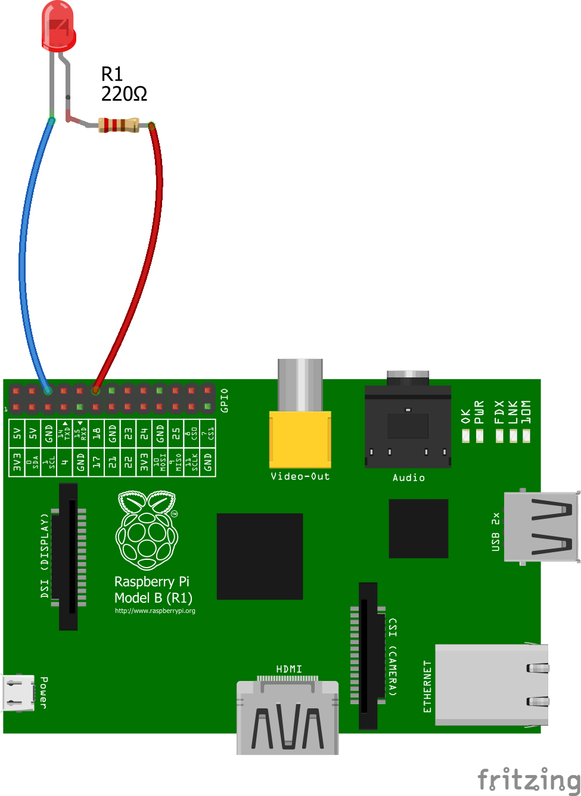

# Raspberry pi PWM 

This little program was designed to test the PWM function of the rasberry pi.

### pwm_ENG.py

The program looks like this during operation.

```sh
--------------------------------------------------------------------------------
                  Ctrl-c will interrupt the program and exit.
--------------------------------------------------------------------------------
 The value of the duty cycle :  50 %
 The value of the frequency  :  1 Hz
--------------------------------------------------------------------------------
 How many percentage should be the duty cycle (1-100%): 30
 How many should be the frequency? (1-19200Hz)        : 10
```
### pwm_HU.py

Így néz ki a program futás közben.

```sh
--------------------------------------------------------------------------------
                A 'Ctrl-c'-re megszakítja a programot és kilép.
--------------------------------------------------------------------------------
 A kitöltési tényező értéke :  50 %
 A frekvencia értéke        :  1 Hz
--------------------------------------------------------------------------------
 Mennyi legyen a kitöltési tényező? (1-100%): 40
 Mennyi legyen a frekvencia? (1-19200Hz)    : 10
```

#### How to start the program

```sh
$ chmod +x *.py
$ ./pwm_ENG.py

or

$ ./pwm_HU.py
```

#### So I tried it out

<p align="center">

<div align="center"><i>In Fritzing program</i></div>
</p>
